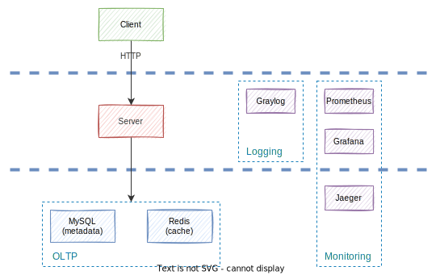

# TinyURL

- [TinyURL](#tinyurl)
  - [Goal](#goal)
  - [Getting Started](#getting-started)
    - [Prerequisites](#prerequisites)
    - [Quick install instructions](#quick-install-instructions)
    - [Usage](#usage)
    - [Monitoring](#monitoring)
    - [Logging](#logging)
    - [Swagger](#swagger)
  - [Project Layout](#project-layout)
  - [High Level System Design](#high-level-system-design)
  - [Documentations](#documentations)
    - [Release Note](#release-note)
    - [Database Schemas](#database-schemas)
    - [API References](#api-references)
  - [References](#references)
    - [TinyURL](#tinyurl-1)
    - [Database](#database)
    - [Testing](#testing)
    - [Github Actions](#github-actions)
    - [Deployment](#deployment)
    - [Monitoring](#monitoring-1)
    - [Logging](#logging-1)
    - [Distributed Tracing](#distributed-tracing)

---

## Goal

- Create a shorter aliases for original URLs.
- POC 練習

---

## Getting Started

### Prerequisites

- Go
- Docker

### Quick install instructions

```shell
make init
```

### Usage

建置並啟動 Tiny URL 專案所需的所有服務，包含：

- API Server (主要服務)
- Grafana (效能監控)
- Graylog (日誌系統)
- Jaeger (分散式鏈路追蹤)
- Locust (壓力測試工具)

```shell
make demo
```

短網址製作範例

```shell
curl -d '{"url":"http://replace/for/your/url", "alias":""}' -H "Content-Type: application/json" -X POST http://localhost:6600/api/v1/create
```

執行整合測試

```shell
make integration-test
```

重新載入壓力測試腳本 (適用於修改 test/benchmark/ 底下的 .py 腳本時)

```shell
make restart-benchmark
```

更多指令請查閱：

```shell
make help
```

### Monitoring

點擊 http://localhost:3000 即可進入 Grafana 觀察各服務的即時指標

- 預設帳號: admin/admin
- `deployments/grafana/` 內提供 MySQL, Redis, Server 儀表板範本

點擊 http://localhost:16686 即可進入 Jaeger 觀察向 TinyURL 服務的請求處理流程

### Logging

點擊 http://localhost:9000 即可進入 Graylog 觀察 TinyURL 服務的日誌記錄
 
 - 預設帳號: admin/admin
 - 第一次進入時需要至 `Sysmtem/Inputs` 設定資料來源

### Swagger

點擊 http://localhost:6600/swagger/index.html 訪問 Swagger 文件

---

## Project Layout

- 參考 [Standard Go Project Layout](https://github.com/golang-standards/project-layout)

```
TinyURL
 ├─ .github/         
 │   └─ workflows/   
 ├─ cmd/             # 本專案的主要應用程式
 ├─ conf.d/          # 組態設定的檔案範本及預設設定
 ├─ deployments/     # 系統和容器編配部署的組態設定腳本
 │   ├─ data/           # 保存 docker volume
 │   ├─ grafana/        # Grafana 預設儀表板
 │   ├─ locust/         # Locust 組態設定
 │   ├─ mysql/          # MySQL 組態設定與動態連結函式庫 (dll)
 │   └─ prometheus/     # prometheus 組態設定
 ├─ docs/            # 設計和使用者文件 (sequence, db schema, etc.)
 ├─ internal/        # 私有應用程式和函示庫的程式碼
 │   ├─ accessor/       # 基礎建設模組
 │   ├─ config/         # 組態設定模組 (viper)
 │   ├─ integration/    # 整合測試模組
 │   ├─ server/         # TinyURL WebAPI Server
 │   ├─ storage/        # 資料庫模組
 |   |   ├─ kvstore/       # key-value store
 |   |   └─ rdb/           # relational database
 │   └─ tracer/         # OpenTracing 模組 (jaeger)
 ├─ test/            # 額外的外部測試應用程式和測試資料
 │   └─ benchmark/      # 壓力測試腳本
 ├─ tools/           # 支援工具
 ├─ .gitattributes   
 ├─ .gitignore       
 ├─ .golangci.yaml   
 ├─ dockerfile       
 ├─ go.mod           
 ├─ go.sum           
 ├─ LICENSE          
 ├─ main.go          # 主程式進入點
 ├─ makefile         
 └─ README.md        
```

---

## High Level System Design



---

## Documentations

### Release Note

- [Here 👀](./docs/RELEASE_NOTE.md)

### Database Schemas

- [urls](./docs/mysql/urls.md)

### API References

- [產生短網址流程](./docs/api/v1/create.md)
- [短網址跳轉流程](./docs/api/v1/redirect.md)

---

## References
### TinyURL

- [[Blog] Designing a URL Shortening service like TinyURL](https://www.educative.io/module/lesson/grokking-system-design-interview/xVZVrgDXYLP#a.-Encoding-actual-URL)
- [[Blog] 短 URL 系统是怎么设计的？](https://www.zhihu.com/question/29270034)
- [[Doc] Fiber Web Framework](https://docs.gofiber.io/)
- [[Wiki] MurMurHash](https://en.wikipedia.org/wiki/MurmurHash)

### Database

- [[Doc] GORM Guides](https://gorm.io/docs/index.html)
- [[Blog] 如何查看 MySQL 語句執行紀錄](https://learnku.com/articles/33773)

### Testing

- [[Doc] Locust](https://docs.locust.io/en/stable/)

### Github Actions

- [[Github] Marketplace/Actions/Run golangci-lint](https://github.com/marketplace/actions/run-golangci-lint)
- [[Github] github-actions-golang](https://github.com/mvdan/github-actions-golang)
- [[Github] Quickstart for GitHub Actions](https://docs.github.com/en/actions/quickstart)

### Deployment

- [[Blog] 多个docker-compose共享网络并相互调用服务](https://juejin.cn/post/7070401263019491365)

### Monitoring

- [[Blog] docker-compose 搭建 Prometheus+Grafana监控系统](https://www.cnblogs.com/qdhxhz/p/16325893.html)
- [[Blog] Prometheus+Grafana+Go服务自建监控系统入门](https://www.xhyonline.com/?p=1492)
- [[Blog] 通过实例理解Go Execution Tracer](https://tonybai.com/2021/06/28/understand-go-execution-tracer-by-example/)

### Logging

- [[Blog] 開源Graylog統整報表　跨越設備日誌格式鴻溝(上)](https://www.netadmin.com.tw/netadmin/zh-tw/technology/DBD49A35B0E5435F9809DA5C0E9D1E5A)
- [[Doc] Graylog : GELF](https://docs.graylog.org/docs/gelf)
- [[Doc] Docker : Configure logging drivers](https://docs.docker.com/config/containers/logging/configure/)
- [[Doc] Docker : Graylog Extended Format logging driver](https://docs.docker.com/config/containers/logging/gelf/)
- [[Blog] Day 30- 三周目 - Docker network 暨完賽回顧](https://ithelp.ithome.com.tw/articles/10206725)
- [[Blog] 从零开始搭建一个简单实用的微服务模板 Part 1](https://blog.igota.net/posts/20220422/)

### Distributed Tracing

- [[Blog] 分布式调用链调研（pinpoint,skywalking,jaeger,zipkin等对比）](https://www.cnblogs.com/Ming8006/p/13793598.html)
- [[Blog] SkyWalking 如何以改动最低的方式整合到Go业务代码中去](https://juejin.cn/post/6871928187123826702)
- [[Doc] Jaeger APM Framework](https://www.jaegertracing.io/docs/1.38/)
- [[Github] fiber-opentracing Middleware](https://github.com/aschenmaker/fiber-opentracing)
- [[Blog] Golang 分布式链路追踪之jaeger](https://bbs.huaweicloud.com/blogs/352913)
- [[Github] go-redis-opentracing](https://github.com/globocom/go-redis-opentracing)