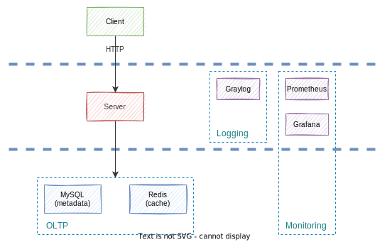

# TinyURL

- [TinyURL](#tinyurl)
  - [Goal](#goal)
  - [Getting Started](#getting-started)
    - [Prerequisites](#prerequisites)
    - [Quick install instructions](#quick-install-instructions)
    - [Usage](#usage)
    - [Monitoring](#monitoring)
  - [High Level System Design](#high-level-system-design)
  - [File Architecture](#file-architecture)
  - [References](#references)
    - [TinyURL](#tinyurl-1)
    - [Database](#database)
    - [Testing](#testing)
    - [Github Actions](#github-actions)
    - [Deployment](#deployment)
    - [Monitoring](#monitoring-1)
    - [Logging](#logging)

---

## Goal

- Create a shorter aliases for original URLs.
- Side project practice (implementations, write documentations, deployment and monitoring)

---

## Getting Started

### Prerequisites

- Go
- Docker

### Quick install instructions

```shell
make init
```

### Usage

Enable whole of applications by docker-compose.

```shell
make demo
```

Now, you can make your own tiny url following this example :

```shell
curl -d '{"url":"http://replace/for/your/url", "alias":""}' -H "Content-Type: application/json" -X POST http://localhost:6600/api/v1/create
```

Test by integraion testing command : 

```shell
make integration-test
```

Run the customize benchmark on http://localhost:8089 after enter the following command : 

```shell
make benchmark-up
```

Get more help by enter :

```shell
make help
```

### Monitoring

Enter http://localhost:3000 to see grafana monitoring.

- I was prepared two simple dashboard templates for you in `deployment/grafana/`, one is mysql dashboard, another is server dashboard.

---

## High Level System Design



---

## File Architecture

```
TinyURL
 ├─ .github/         # includes github actions
 ├─ benchmark/       # includes benchmark testcases
 ├─ cmd/             # golang cli (cobra)
 ├─ conf.d/          # includes configuration files
 ├─ config/          # golang config manager (viper)
 ├─ deployment/      # includes docker-compose, mysql seed, etc.
 ├─ doc/             # includes documentations (sequence, db schema, etc.)
 ├─ integration/     # includes integration testcases
 ├─ pkg/             # includes core modules (apis, storages, etc.)
 ├─ util/            # includes common modules (base converter, etc.)
 ├─ .gitattributes
 ├─ .gitignore
 ├─ .golangci.yaml   # golang linter settings
 ├─ dockerfile
 ├─ go.mod           # go mod files
 ├─ go.sum           # go mou files
 ├─ LICENSE
 ├─ main.go          # program entry point
 ├─ makefile         # cli tool
 └─ README.md
```

---

## References

### TinyURL

- [[Wiki] MurMurHash](https://en.wikipedia.org/wiki/MurmurHash)

### Database

- [[Blog] 如何查看 MySQL 語句執行紀錄](https://learnku.com/articles/33773)

### Testing

- [[Doc] Locust](https://docs.locust.io/en/stable/)

### Github Actions

- [[Github] Marketplace/Actions/Run golangci-lint](https://github.com/marketplace/actions/run-golangci-lint)
- [[Github] github-actions-golang](https://github.com/mvdan/github-actions-golang)
- [[Github] Quickstart for GitHub Actions](https://docs.github.com/en/actions/quickstart)

### Deployment

- [[Blog] 多个docker-compose共享网络并相互调用服务](https://juejin.cn/post/7070401263019491365)

### Monitoring

- [[Blog] docker-compose 搭建 Prometheus+Grafana监控系统](https://www.cnblogs.com/qdhxhz/p/16325893.html)
- [[Blog] Prometheus+Grafana+Go服务自建监控系统入门](https://www.xhyonline.com/?p=1492)

### Logging

- [[Doc] Graylog : GELF](https://docs.graylog.org/docs/gelf)
- [[Doc] Docker : Graylog Extended Format logging driver](https://docs.docker.com/config/containers/logging/gelf/)
- [[Blog] Day 30- 三周目 - Docker network 暨完賽回顧](https://ithelp.ithome.com.tw/articles/10206725)