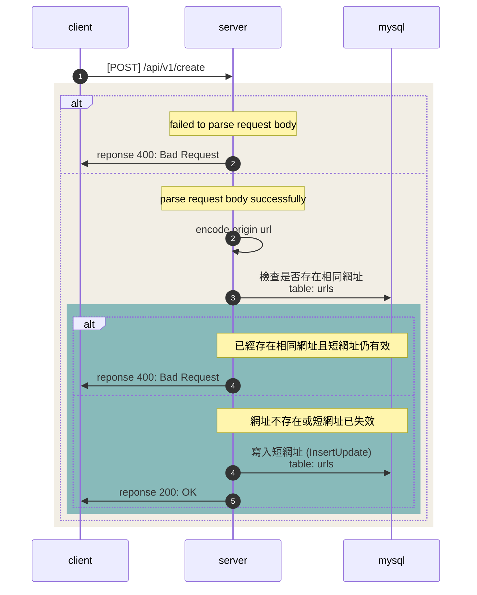

## 縮網址

**POST** `{domain}/api/v1/create`

### Authorization

- none

### Request 

Request Body

| Field  | Type   | Required | Description |
| ------ | ------ | :------: | ----------- |
| url    | string | Yes      | 原始網址 |
| alias  | string | No       | 指定短網址替代碼 |

### Response

Schema

| Field   | Type   | Description |
| ------- | ------ | ----------- |
| origin  | string | 原始網址 |
| tiny    | string | 短網址 |
| created_at | string | 短網址產生時間 |
| expires_at | string | 短網址失效時間 |

### Flow

