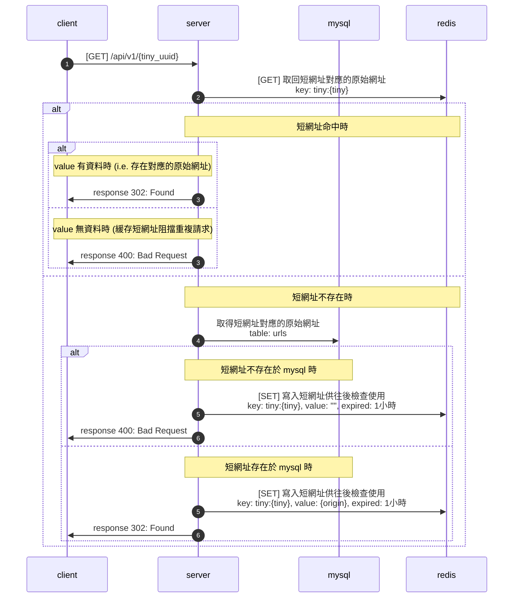

## 跳轉網址

**GET** `{domain}/api/v1/{tiny_uuid}`

### Authorization

- none

### Request

Path Prameters

| Parameter  | Description |
| ---------- | ----------- |
| tiny_uuid  | 短網址 UUID |

### Response

- none

### Flow

